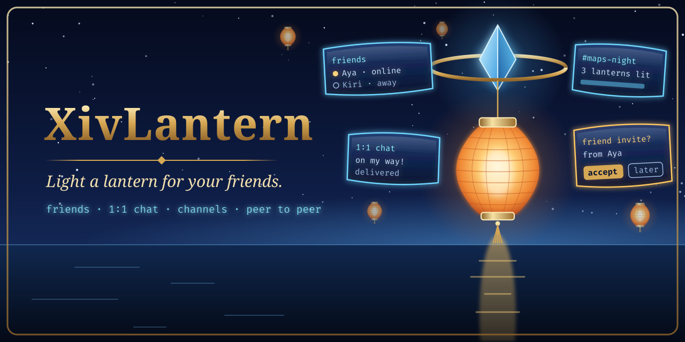

# XivLantern

<p align="center">
  <picture>
    <source media="(prefers-color-scheme: dark)" srcset="images/readme/hero-dark.png">
    <source media="(prefers-color-scheme: light)" srcset="images/readme/hero-light.png">
    
  </picture>
</p>


**[Site](https://spacegho.st/mods/ffxiv/xivlantern/) · [Install](https://spacegho.st/mods/ffxiv/plugins/) · [Vote on what's next](https://spacegho.st/mods/ffxiv/xivlantern/vote/) · [Screenshots](https://spacegho.st/mods/ffxiv/term/gallery/?mod=xivlantern) · [Changelog](CHANGELOG.md)**

Lanterns for FINAL FANTASY XIV: friends light a lantern to say they are here.
A friend list with presence, 1:1 chat and channels, peer to peer over
[iroh](https://www.iroh.computer/), plus an opt-in channel where the mod's
author posts signed announcements and players can write back. A Dalamud plugin
(`/lantern`, or `/xivlantern`) over a Rust network layer (`lantern.dll`).

> **Status: not yet verified in game.** Everything here is tested on a Linux
> host: the network layer, its C ABI, the C# binding, and the plugin's logic.
> The Windows build of the network layer passed its selftest and talked to a
> native node under a stock Wine 11 in a container ([docs/WINE.md](docs/WINE.md)).
> The plugin compiles against Dalamud 15 but has never been loaded by it.
> `/lantern selftest` in game is the next proof. This is the required
> direction, not a claim that it works.

## What it does

* **Friends by invite.** Make a one-time invite, send it privately; whoever
  uses it first becomes your friend, on both sides. Nothing is ever accepted
  for you. Presence (online, away, busy, invisible, and a note you type).
* **1:1 chat** that waits: a message to someone offline goes out when they are
  next online, and you see when it arrives.
* **Channels** you make and invite friends into. Anyone holding a channel's
  ticket can join and read it.
* **The author channel** (opt in): announcements signed with a key that never
  leaves the author's machine, checked before they are shown, and a way to
  write to the author. See [docs/AUTHOR.md](docs/AUTHOR.md).
* **Safety.** Block (silently), mute, per-person rate limits, size limits, no
  auto-accept.
* **Toasts and a server info bar entry**, following your mutes.
* **IPC for sibling plugins**, each part behind its own consent switch
  ([docs/IPC.md](docs/IPC.md)).

## Privacy, briefly

Off until you turn it on, and the first screen says who can see what. Nothing
from the game is read or sent — not your character's name, world, location or
chat; your friends see the name you type (a test fails the build if the
plugin ever asks the game who you are). Friends see your node id and your IP
addresses. With the default relays, n0's relay servers see your IP address and
when you are online, and forward encrypted traffic they cannot read. "Relays
off" contacts no third party at all, and works on a LAN or with open ports.
A custom relay URL uses a relay you or your FC run.
[docs/DESIGN.md](docs/DESIGN.md) has the full threat model.

Third-party plugins are against the FFXIV terms of service. Lantern never
automates or sends a game action; it is a separate chat that draws in game.

## Layout

| Path | What |
| --- | --- |
| `crates/lantern-core` | iroh endpoint, gossip rooms, friends, author channel, SQLite |
| `crates/lantern-ffi`, `include/lantern.h` | the C ABI (`lantern.dll`) |
| `crates/lantern-cli` | `lantern`, a terminal client, and the author's signing tool |
| `bindings/csharp` | P/Invoke binding (`Lantern.Interop.dll`) |
| `src/XivLantern.Core` | the plugin's logic, BCL only, host tested |
| `src/XivLantern.Plugin` | the Dalamud plugin |
| `docs/` | design, Wine evidence, IPC, the author channel, releasing |

## Install (from the plugin repository)

```text
https://spacegho.st/mods/ffxiv/plugins.json
```

1. `/xlsettings` → **Experimental** → **Custom Plugin Repositories**: add the URL, **+**, save.
2. `/xlplugins` → **All Plugins**: search **XivLantern**.

[The repository's page](https://spacegho.st/mods/ffxiv/plugins/) walks through the same steps. For a dev
plugin, see [Building](#building).

## Building

Never on the machine the game runs on. In the Incus builder:

```sh
scripts/sync-to-builder.sh
incus exec fedora:iroh-build -- bash -lc 'cd /root/xiv-lantern &&
  cargo test --workspace &&
  tools/build-native.sh &&
  tools/fetch-dalamud.sh && export DALAMUD_HOME=$PWD/.dalamud &&
  dotnet test tests/XivLantern.Core.Tests -c Release &&
  dotnet build src/XivLantern.Plugin/XivLantern.Plugin.csproj -c Release &&
  tools/package.sh'
```

`tools/package.sh` writes `latest.zip` (XivLantern.dll, XivLantern.Core.dll,
Lantern.Interop.dll, lantern.dll, XivLantern.json). For a dev plugin,
unpack it into a folder and add that folder's `XivLantern.dll` under
Dalamud Settings → Experimental → Dev Plugin Locations.

The terminal client is the quickest way to try the network layer:

```sh
lantern --db alice.sqlite --name Alice --relay off     # /help for commands
```

## Releasing

`tools/release.sh`, the same as every one of these mods; see
[docs/RELEASING.md](docs/RELEASING.md). The GitHub repository does not exist
yet, so nothing has been released.
